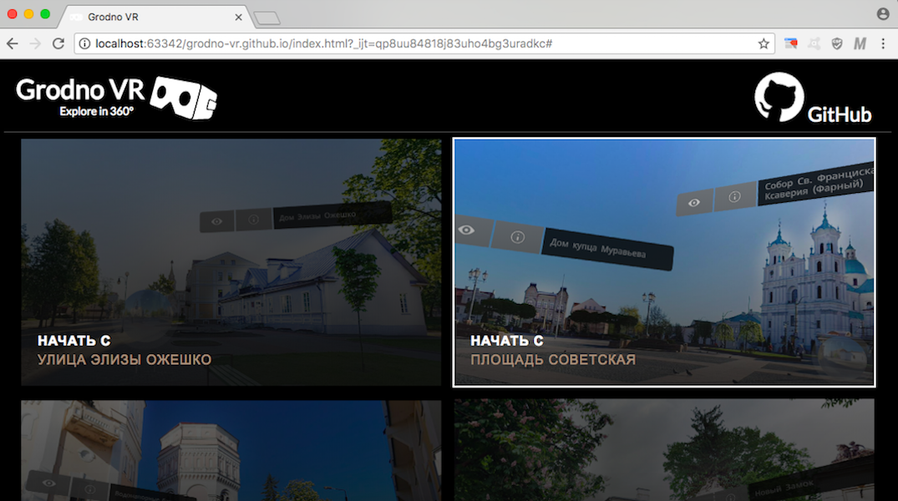
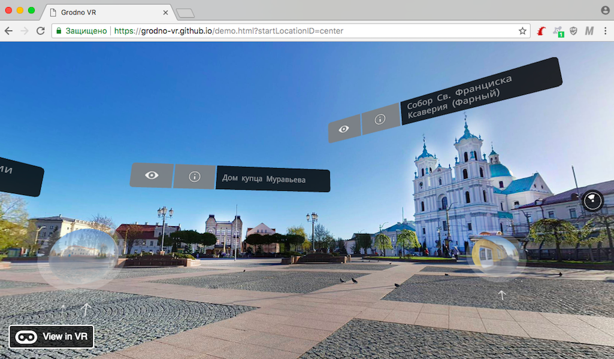
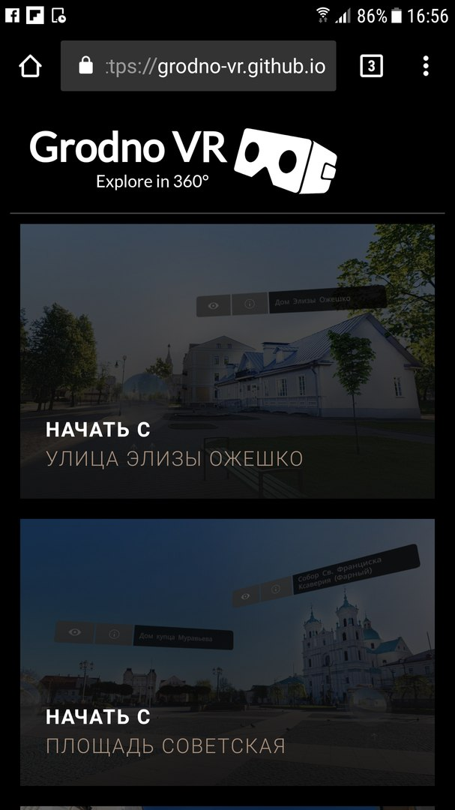
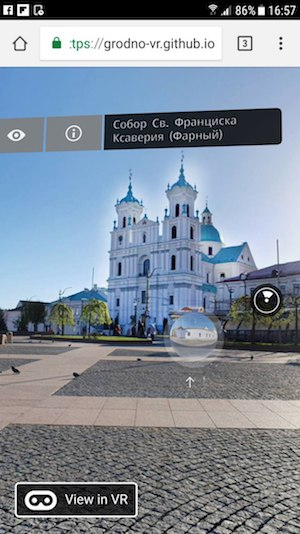
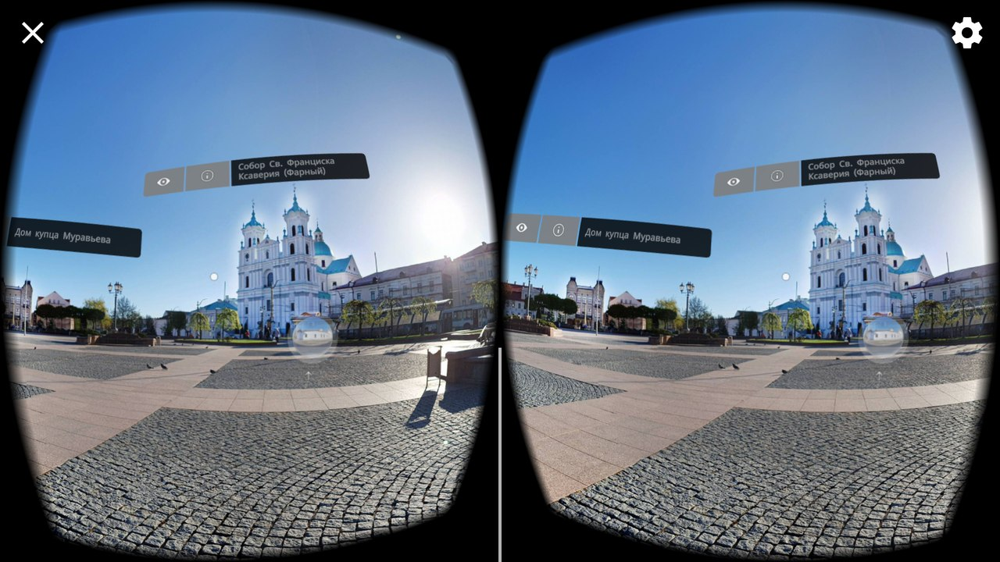

# [GrodnoVR Demo](https://grodno-vr.github.io)
> :church: Старые фотографии города Гродно в  режиме виртуальной реальности, демо с открытым исходным кодом на основе [ReactVR](https://facebook.github.io/react-vr) библиотеки.

> Подробнее о проекте можно почитать в статье [GrodnoVR: My first and last experience with ReactVR](https://medium.com/front-end-in-regions-grodno/grodnovr-my-first-and-last-experience-with-reactvr-7ac156fc1a70)





### Старт проекта

Клонируйте репозиторий и установите все необходимые зависимости (для установки зависимостей вам понадобится [node.js](https://nodejs.org) и [npm](https://www.npmjs.com/)):
```
git clone https://github.com/grodno-vr/grodno-vr.github.io
cd grodno-vr.github.io
npm i
```

После установки выполните команду запуска:
```
npm run start
```

Откройте демо-проект в браузере по следующему адресу:
```
http://localhost:8081/vr
```




Если браузер на вашей платформе поддерживает [WebVR](https://webvr.info), то вы можете перейти в режим стереоизображения посредством нажатия на кнопку "View in VR":



### Поддержка платформ
Работоспособность сайта проверялась на следующих платформах:
+ Google Cardboard + Samsung Galaxy S7 (Chrome)
+ GearVR + Samsung Galaxy S7 (Oculus App)

Есть проблемы на следующих платформах:
+ Ubuntu 16 + Firefox 60 (64 bit)
+ Смартфоны Huawei (на нескольких моделях в разных браузерах)

### Сборка проекта

```
npm run bundle
```

### Титры

Разработка: *Артур Басак*

Помощь в разработке: *Александр Зимаков, Максим Лысаков*

Перевод на английский язык: *Елизавета Чеканова*

3d модели: *Игорь Ламека, Артур Басак*

360-фото: *Артур Басак*

Старинные фото из частных коллекций: *Феликс Ворошильский, Виктор Саяпин, И. Пашпекина, Китурко Константин, Залы торгового центра OldCity*

Большинство фото и текстов взято из публичных источников: *wikipedia.org, newgrodno.by, oldgrodno.by, old.grodno.net, grodno.net, grodnonews.by, kinogrodno.by, vgr.by, hrodno.life, harodnia.com, grodno.in, holiday.by, galina-lukas.ru, radzima.org, s13.ru, ggau.by, trainer.by, tut.by, zetgrodno.com, allcastles.ru, ay.by, wikimedia.org, drama.grodno.by, katolik.life*