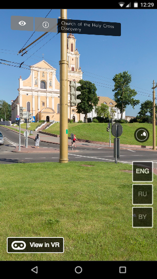
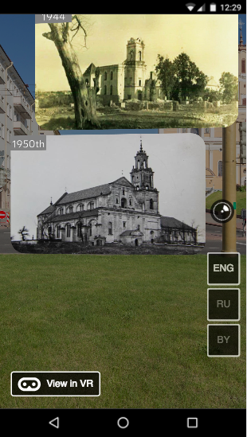

# [GrodnoVR Demo](https://grodno-vr.github.io/)
> :church: Старые фотографии города Гродно в виртуальной реальности, демо на основе [ReactVR](https://facebook.github.io/react-vr) библиотеки


### Старт проекта

Клонируйте репозиторий и установите все необходимые зависимости (для установки зависимостей вам понадобится [node.js](https://nodejs.org) и [npm](https://www.npmjs.com/)):
```
git clone https://github.com/grodno-vr/grodno-vr.github.io
cd grodno-vr.github.io
npm i
```

После установки выполните команду запуска:
```
npm run start
```

Откройте демо-проект в браузере по следующему адресу:
```
http://localhost:8081/vr
```





### Поддержка платформ

TBD

Есть проблемы на мобильных девайсах:
+ Samsung Galaxy S7 (Chrome)
+ Huawei (на нескольких моделях в разных браузерах)

### Запуск тестов

TBD

### Сборка проекта

TBD

